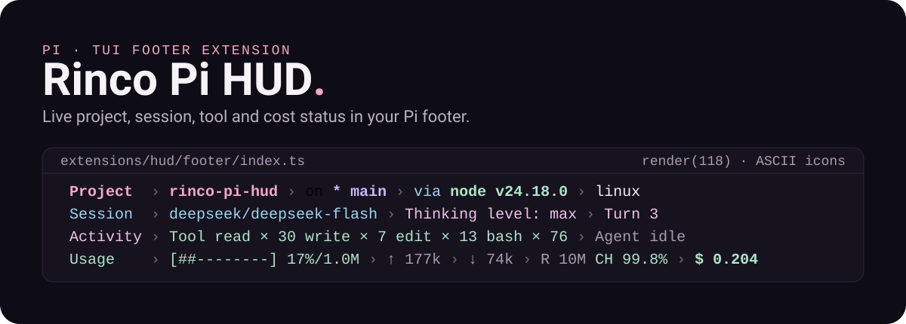
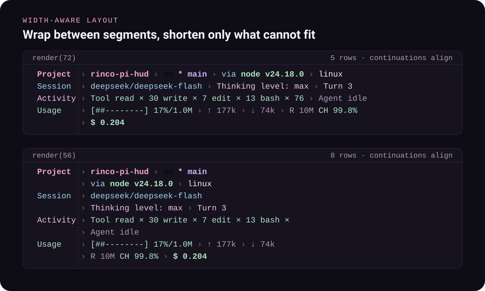

<div align="center">

# Rinco Pi HUD

**A live status footer for [Pi](https://github.com/earendil-works/pi).** Project, git, session, tool and cost state in four groups, updated while you work.

[](https://github.com/earendil-works/pi) [](https://www.typescriptlang.org/) [](https://vitest.dev/) [](LICENSE)

[Install](#install) · [Commands](#commands) · [What it shows](#what-it-shows) · [Layout](#layout) · [Development](#development)

[简体中文](docs/README.zh-CN.md)

</div>

<p align="center">
  
</p>

Rinco Pi HUD takes over Pi's footer with four groups of live state and lets you switch off anything you do not want. Pi loads the TypeScript extension directly, so there is no build step: `tsconfig.json` sets `noEmit: true` and exists only for `npm run typecheck`.

## Install

```bash
pi install npm:rinco-pi-hud
```

Restart Pi afterwards, or run `/reload`. The footer is enabled by default and `/zentui` opens the settings UI.

From GitHub, or from a local checkout:

```bash
pi install git:github.com/Rinisnotarobot/rinco-pi-hud
```

```bash
git clone https://github.com/Rinisnotarobot/rinco-pi-hud.git
cd rinco-pi-hud
pi install "$PWD"
```

> [!IMPORTANT]
> Pi extensions run with your user permissions. Review the source before installing any third-party extension.

> [!NOTE]
> The footer needs a Truecolor terminal. The screenshot above renders with ASCII icon mode; `/zentui` switches between the `auto`, `nerd`, and `ascii` glyph sets.

## Commands

| Command | Effect |
| --- | --- |
| `/zentui` | Settings UI: rows, segments, separator, icons, colors, templates |
| `/zentui statusline enable\|disable\|toggle` | Show or hide the whole footer |
| `/zentui row project\|session\|activity\|usage <enable\|disable\|toggle>` | Turn one row on or off |
| `/zentui format "<template>"` | Replace the four rows with a single-line template |
| `/codex-status` | Print Codex subscription usage and rate-limit windows |
| `/usage-refresh` | Refresh the model usage or balance shown in the footer |

## What it shows

| Row | Segments, each with its own switch under **Built-in segments** in `/zentui` |
| --- | --- |
| **Project** | directory, git branch, commit and tag, working-tree status, operation state (`MERGING`, `REBASING`, …), diff metrics, runtime, package version, OS, user |
| **Session** | session name, provider and model, thinking level, turn count, duration |
| **Activity** | running tools, completed tool counts, active agents, `Agent idle`, skills, MCP servers |
| **Usage** | context window with a gauge, input and output tokens, cache read/write volume and hit rate, cost, model quota, clock |

Rows are toggled with `/zentui row usage disable`; the segments inside them have individual switches in the same UI. Existing configs that used the former aggregate `tokens`, `toolActivity`, or `agentActivity` switches are migrated automatically.

### Model quota

The Usage row follows the active model's provider:

- **openai-codex** — ChatGPT subscription rate limits and reset credits, queried through Pi auth with a `codex app-server` fallback. Reads as `codex 60% 5h (14:30) 75% wk`; the reset stamp becomes `14:30 12 Feb` when the window rolls into another day.
- **token-switch** — billing balance from the `TOKEN_SWITCH_API_KEY` environment variable, as `token-switch $750.00`.
- **deepseek** — account balance from the DeepSeek API using the credential Pi holds for the provider, either from `/login` or `DEEPSEEK_API_KEY`. Reads as `deepseek ¥110.00`, preferring CNY when the account reports several currencies.

These queries use a 15-second timeout and a 5-minute cache, and `/usage-refresh` refreshes the active one on demand.

## Layout

<p align="center">
  
</p>

Groups wrap only at segment boundaries. A continuation line realigns under the separator column, and a segment that no longer fits is shortened with `…` instead of pushing the segments after it off the row.

Set a template for a single-line footer instead of the four groups:

```text
/zentui format "$cwd( $git_branch)$fill($context)( $tokens)( $cost)"
```

Variables accept `$name` or `${name}`. The [footer reference](docs/footer.md) lists all of them, along with the aliases (`$directory`, `$status`, `$codex`, …). Run `/zentui format` with no argument, or `/zentui format clear`, to go back to the four groups.

## Configuration

`/zentui` writes to `~/.pi/agent/rinco-pi-hud.json` and applies changes immediately. It covers the separator style, icon mode (`nerd`, `ascii`, or `auto`), footer colors (Pi theme tokens or terminal palette styles), context rendering (text, gauge, or both), the project refresh interval, and third-party extension statuses with their own placement and color mode.

See [docs/footer.md](docs/footer.md) for the full variable and segment reference.

## Project contents

| Path | Purpose |
| --- | --- |
| [`extensions/hud/index.ts`](extensions/hud/index.ts) | Composition root for controllers, shared state, and UI installation |
| [`extensions/hud/config/`](extensions/hud/config/config.ts) | Configuration model, normalization, migration, and persistence |
| [`extensions/hud/footer/`](extensions/hud/footer/index.ts) | Footer rendering, semantic grouping, responsive layout, and template parsing |
| [`extensions/hud/segments/`](extensions/hud/segments/) | State collectors: Git, runtime, MCP, skills, projects, etc. |
| [`extensions/hud/telemetry/`](extensions/hud/telemetry/format.ts) | Usage formatting, provider balance probes, and the Codex subscription client |
| [`extensions/hud/session/`](extensions/hud/session/) | Pi event registration, session lifecycle, and live context overlay |
| [`extensions/hud/state/`](extensions/hud/state/) | Aggregated state, telemetry reducer, and project refresh controller |
| [`extensions/hud/commands/`](extensions/hud/commands/settings.ts) | `/zentui` settings UI and configuration controller |
| [`extensions/hud/ui/`](extensions/hud/ui/) | Icons and terminal style utilities |
| [`docs/footer.md`](docs/footer.md) | Complete footer configuration reference |
| [`docs/CONTRIBUTING.md`](docs/CONTRIBUTING.md) | Local development, testing guidance, and pull request checklist |
| [`tests/`](tests/) | Vitest suite: footer layout, telemetry, provider balances, MCP parsing |

## Development

Node.js 22.19 or later, and [Pi](https://github.com/earendil-works/pi) itself.

```bash
npm install
npm test          # Vitest suite
npm run typecheck # tsc --noEmit
npm run verify    # format, types, lint, tests
```

Every script is defined in [`package.json`](package.json); [docs/CONTRIBUTING.md](docs/CONTRIBUTING.md) lists them all, including `lint`, `format`, and `test:watch`.

### README images

The two boards above are generated from a real footer render rather than drawn by hand. `assets/readme/source/capture-footer.mts` drives the extension's own `installFooter` path over this repository's state and a real Pi session transcript, then `build-assets.mts` turns the ANSI rows into SVG:

```bash
npx tsx assets/readme/source/capture-footer.mts . ~/.pi/agent/sessions/<session>.jsonl 118 72 56 > /tmp/footer.json
npx tsx assets/readme/source/build-assets.mts /tmp/footer.json
```

## Troubleshooting

<details>
<summary>The footer does not appear</summary>

Confirm Pi is running in TUI mode rather than headless, JSON, or print mode. Then run `/reload`, and `pi list` to confirm the package is installed.
</details>

<details>
<summary>The layout looks wrong in a narrow terminal</summary>

The footer measures the terminal and wraps at segment boundaries, so narrow windows show fewer segments per line. Set a `footerFormat` template, or disable low-priority segments in `/zentui`.
</details>

<details>
<summary>Colors look incorrect</summary>

The default palette emits `38;2;r;g;b` Truecolor sequences that terminals without Truecolor support approximate or ignore.
</details>

<details>
<summary>Icons are missing or misaligned</summary>

Unicode and Nerd Font glyphs vary between terminals and fonts. Install a Nerd Font, or switch to ASCII icons in `/zentui`.
</details>

## License

MIT. See [`LICENSE`](LICENSE).

## Third-party licenses

This package incorporates work from the following open-source projects:

- **pi-zentui** by Luka — MIT licensed. The Footer portion was adapted for this package.  
  Source: https://github.com/lmilojevicc/pi-zentui
- **pi-shannon-statusline** by RealAlexandreAI — MIT licensed. Session, model, activity, MCP, configuration-count, and Codex subscription capabilities were adapted.  
  Source: https://github.com/RealAlexandreAI/pi-shannon-statusline
- **pi-codex-usage** by narumiruna — MIT licensed. The Codex usage client under `extensions/hud/telemetry/codex-usage/` derives from this project.  
  Source: https://github.com/narumiruna/pi-codex-usage

See [NOTICE](NOTICE) for details.
